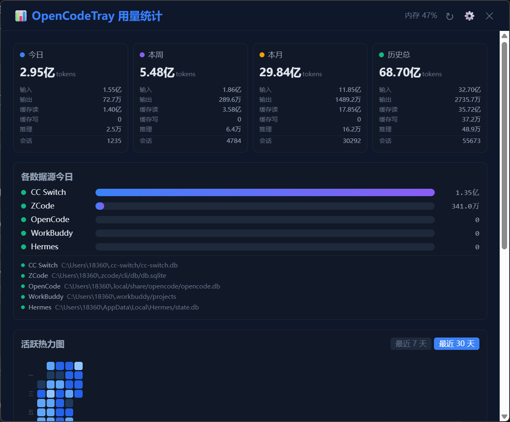
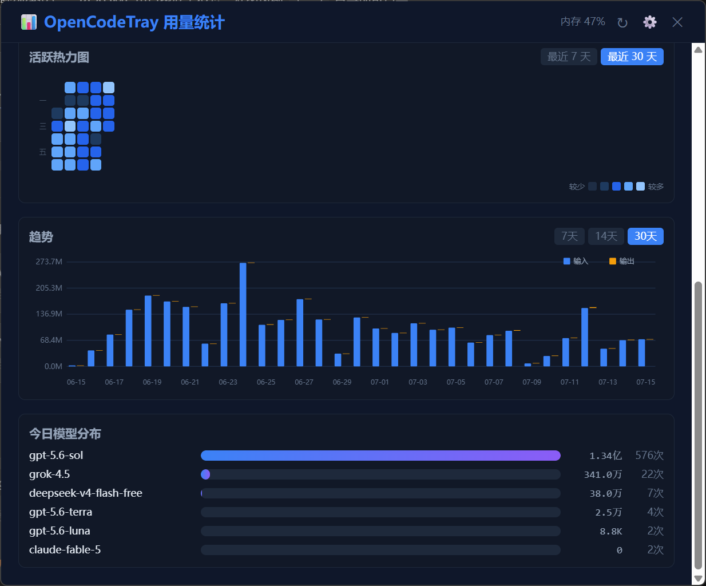

# OpenCodeTray-RS

<p align="center">
  <strong>🖥️ 一款轻量级系统托盘工具，实时监控 AI 编码助手的 Token 消耗量</strong>
</p>

<p align="center">
  <a href="./LICENSE"></a>
  
  
  
</p>

---

## ✨ 功能特性

- 🔔 **系统托盘** — 托盘图标实时显示今日 Token 消耗，鼠标悬停显示详细统计
- 📊 **数据面板** — 统计卡片 + 趋势折线图 + 每日热力图 + 模型分布 + 数据源列表
- 🫧 **悬浮条** — 透明置顶的迷你悬浮条，始终可见，不遮挡工作区
- ⚙️ **灵活配置** — 刷新间隔、显示模式、汇率换算、开机自启、自定义数据源路径
- 🔒 **单实例运行** — 自动阻止重复启动，避免数据冲突
- 💾 **纯本地** — 零网络请求，所有数据来自本地 SQLite/JSONL，隐私安全

## 📡 支持的数据源

| 数据源 | 说明 | 数据路径 |
|--------|------|---------|
| **OpenCode** | OpenCode CLI 编码助手 | `~/.local/share/opencode/opencode.db` |
| **CC Switch** | CC Switch 代理网关 | `~/.cc-switch/cc-switch.db` |
| **WorkBuddy** | WorkBuddy 编码助手 | `~/.workbuddy/projects/**/*.jsonl` |
| **Hermes** | Hermes 编码助手 | `%LOCALAPPDATA%/Hermes/state.db` |
| **ZCode** | ZCode CLI 编码助手 | `~/.zcode/cli/db/db.sqlite` |

> 💡 所有数据源路径均可在设置中自定义。

## 📸 截图

### 主面板 — 统计概览

<p align="center">
  
</p>

统计卡片（今日 / 本周 / 本月 / 历史总计）、各数据源今日用量、每日活动热力图。

### 主面板 — 趋势 & 模型分布

<p align="center">
  
</p>

输入/输出 Token 趋势折线图、今日模型用量分布。

### 悬浮条

<p align="center">
  
</p>

透明置顶的迷你悬浮条，常驻屏幕一角，实时显示今日 Token 用量与内存占用，不遮挡工作区。

## 🚀 快速开始

### 前置要求

- [Node.js](https://nodejs.org/) ≥ 18
- [pnpm](https://pnpm.io/) ≥ 8
- [Rust](https://www.rust-lang.org/tools/install) ≥ 1.77.2
- [Tauri 2 CLI](https://tauri.app/start/prerequisites/)

### 安装依赖

```bash
# 安装前端依赖
pnpm install

# Tauri CLI（如未安装）
pnpm add -D @tauri-apps/cli
```

### 开发模式

```bash
pnpm tauri dev
```

### 构建发布

```bash
pnpm tauri build
```

构建产物位于 `src-tauri/target/release/bundle/`。

## 🏗️ 项目结构

```
opencode-tray-rs/
├── src/                        # 前端源码 (React + TypeScript + TailwindCSS)
│   ├── components/
│   │   ├── floating-bar/       # 悬浮条组件
│   │   ├── panel/              # 主面板组件（统计卡片、趋势图、热力图、模型分布、数据源）
│   │   └── settings/           # 设置页面组件
│   ├── hooks/                  # React Hooks
│   └── lib/                    # 工具函数 & Tauri 命令封装
├── src-tauri/                  # 后端源码 (Rust + Tauri 2)
│   ├── src/
│   │   ├── commands/           # Tauri 命令（usage、settings、window）
│   │   ├── db/                 # 数据库访问层
│   │   ├── services/           # 五大数据源适配器
│   │   ├── tray.rs             # 系统托盘逻辑
│   │   └── lib.rs              # 应用入口
│   └── tauri.conf.json         # Tauri 配置
├── package.json
├── vite.config.ts
└── tailwind.config.ts
```

## 🛠️ 技术栈

| 层级 | 技术 |
|------|------|
| 框架 | [Tauri 2](https://tauri.app/) |
| 后端 | Rust 2021 |
| 前端 | React 18 + TypeScript |
| 样式 | TailwindCSS 3 + PostCSS |
| 构建 | Vite 5 |
| 数据库 | rusqlite (bundled SQLite) |
| 包管理 | pnpm |

## 🤝 参与贡献

欢迎贡献！请阅读 [CONTRIBUTING.md](./CONTRIBUTING.md) 了解详情。

1. Fork 本仓库
2. 创建功能分支 (`git checkout -b feature/amazing-feature`)
3. 提交更改 (`git commit -m 'feat: add amazing feature'`)
4. 推送到分支 (`git push origin feature/amazing-feature`)
5. 提交 Pull Request

## 📄 许可证

本项目基于 [MIT License](./LICENSE) 开源。

---

<p align="center">
  Made with ❤️ by the OpenCodeTray community
</p>
